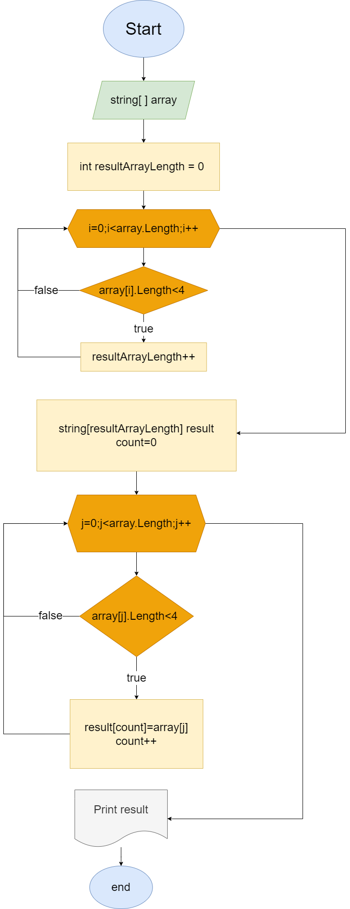

# Контрольная работа Добикова Алексея.

###  Написать программу, которая из имеющегося массива строк формирует новый массив из строк, длина которых меньше, либо равна 3 символам.

1. Составленна блок схема решения задачи.



2. Написанны методы для ввода данных пользователем и захват данных в массив.

```
string Input(string text)
{
    Console.Write($"{text}: ");
    string temp = Console.ReadLine()!;
    return temp;
}
string[] ArrayBuild(string tempStr)
{
    char[] separators = new char[] {',',' '};
    string[] array = tempStr.Split(separators,StringSplitOptions.RemoveEmptyEntries);
    return array;
}
```

3. Метод для подсчета длины итогового массива.

```
int GetLength(string[]array)
{
    int count = 0;
    for (int i = 0; i < array.Length; i++)
    {
        if(array[i].Length<4)count++;   
    }
    return count;
}
```

4. Метод для копирования элементов удовлетворяющих критериям из введенного массива в итоговый.

```
string[] GetResult(string[]array,int length)
{
    string[] result = new string[length];
    int count = 0;
    for (int j = 0; j < array.Length; j++)
    {
        if(array[j].Length<4)
        {
            result[count] = array[j];
            count++;
        }   
    }
    return result;
}
```

5. Метод печати результата.

```
void PrintArray(string[] array)
{
    Console.WriteLine(String.Join(", ", array ));
}  
```

6. Главный метод.

```
void Main()
{
    Console.Clear();
    string mass = Input("Введите ваш массив строк через пробел или запятую");
    string[] array = ArrayBuild(mass);
    PrintArray(array);
    int resultArrayLength = GetLength(array);
    string[] result = GetResult(array, resultArrayLength);
    PrintArray(result);
}
```
